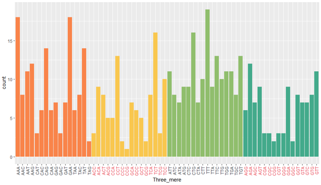

<!-- Improved compatibility of back to top link: See: https://github.com/othneildrew/Best-README-Template/pull/73 -->

<!-- PROJECT LOGO -->
 

<h3 align="center">Fasta-File-3-Mer-Frequency-Analysis </h3>

  

    Department of Bioinformatics, IBB, University of Tehran
     
  

  

<!-- TABLE OF CONTENTS -->

  
Table of Contents

  <ol>
    <li>
      <a href="#Preprocess">Preprocess</a>
    </li>
    <li>
      <a href="#Load_Data">Load Data</a>
    </li>
    	<li>
      <a href="#Define_3-Mers">Define 3-Mers</a>
    </li>
	<li>
      <a href="#Main_Analysist">Main Analysis</a>
    </li>
    	<li>
      <a href="#Plotting">Plotting</a>
    </li>
  </ol>

<!-- ABOUT THE PROJECT -->
## ROADMAP

This repository contains a program written in R for analyzing the frequency of 3-mers in a DNA sequence provided in a fasta file. The script utilizes the seqinr and stringr libraries for working with biological sequences and strings, along with the popular data visualization library ggplot2 for generating informative plots.

(<a href="#readme-top">back to top</a>)

## Languages Used

R Packages 

(<a href="#readme-top">back to top</a>)

<!-- GETTING STARTED -->
## Getting Started
  
### Installation

Install seqinr, stringr, ggplot2, or any alternative that you want.

 ## 1. Preprocess
  <ul id="Preprocess">
      <li>Set the working directory.</li>
      <li>Load required libraries (ggplot2, seqinr, stringr).</li>
  </ul>

  ## 2. Load Data
  <ul id="Load_Data">
      <li>Read the DNA sequence from the "sequence.fasta" file.</li>
      <li>Extract individual sequences and convert them to a character string.</li>
</ul>

## 3. Define 3-Mers
  <ul id="Define_3-Mers">
      <li>Create a list of all possible 3-mers.</li>
</ul>

## 4. Main Analysis
<ul id="Main_Analysis">
      <li>
        Count the occurrences of each 3-mer in the DNA sequence.
      </li>
      <li>Store the results in a vector.</li>
</ul>

## 5. Plotting
  <ul id="Plotting">
      <li>Generate a bar plot using ggplot2 to visualize the frequency of each 3-mer.</li>
      <li>Customize the plot with distinct colors for better clarity.</li>
</ul>

## Usage:
<ul>
  <li>
    Ensure the R environment is set up with the required libraries.
  </li>
  <li>
    Provide the path to the fasta file containing the DNA sequence.
  </li>
  <li>Run the script to obtain a visual representation of 3-mer frequencies.</li>
</ul>

(<a href="#readme-top">back to top</a>)

(<a href="#readme-top">back to top</a>)

<!-- CONTACT -->
Feel free to modify the script or adapt it to your specific needs. Contributions and improvements are welcome!
## Contact

Vafaeeshaarbaf - @gmail.com

(<a href="#readme-top">back to top</a>)

<!-- ACKNOWLEDGMENTS -->
## Acknowledgments

Department of Bioinformatics, IBB, University of Tehran

(<a href="#readme-top">back to top</a>)

<!-- MARKDOWN LINKS & IMAGES -->
<!-- https://www.markdownguide.org/basic-syntax/#reference-style-links -->
[contributors-shield]: https://img.shields.io/github/contributors/github_username/repo_name.svg?style=for-the-badge
[contributors-url]: https://github.com/github_username/repo_name/graphs/contributors
[forks-shield]: https://img.shields.io/github/forks/github_username/repo_name.svg?style=for-the-badge
[forks-url]: https://github.com/github_username/repo_name/network/members
[stars-shield]: https://img.shields.io/github/stars/github_username/repo_name.svg?style=for-the-badge
[stars-url]: https://github.com/github_username/repo_name/stargazers
[issues-shield]: https://img.shields.io/github/issues/github_username/repo_name.svg?style=for-the-badge
[issues-url]: https://github.com/github_username/repo_name/issues
[license-shield]: https://img.shields.io/github/license/github_username/repo_name.svg?style=for-the-badge
[license-url]: https://github.com/github_username/repo_name/blob/master/LICENSE.txt
[linkedin-shield]: https://img.shields.io/badge/-LinkedIn-black.svg?style=for-the-badge&logo=linkedin&colorB=555
[linkedin-url]: https://linkedin.com/in/linkedin_username
[product-screenshot]: images/screenshot.png
[Next.js]: https://img.shields.io/badge/next.js-000000?style=for-the-badge&logo=nextdotjs&logoColor=white
[Next-url]: https://nextjs.org/
[React.js]: https://img.shields.io/badge/React-20232A?style=for-the-badge&logo=react&logoColor=61DAFB
[React-url]: https://reactjs.org/
[Vue.js]: https://img.shields.io/badge/Vue.js-35495E?style=for-the-badge&logo=vuedotjs&logoColor=4FC08D
[Vue-url]: https://vuejs.org/
[Angular.io]: https://img.shields.io/badge/Angular-DD0031?style=for-the-badge&logo=angular&logoColor=white
[Angular-url]: https://angular.io/
[Svelte.dev]: https://img.shields.io/badge/Svelte-4A4A55?style=for-the-badge&logo=svelte&logoColor=FF3E00
[Svelte-url]: https://svelte.dev/
[Laravel.com]: https://img.shields.io/badge/Laravel-FF2D20?style=for-the-badge&logo=laravel&logoColor=white
[Laravel-url]: https://laravel.com
[Bootstrap.com]: https://img.shields.io/badge/Bootstrap-563D7C?style=for-the-badge&logo=bootstrap&logoColor=white
[Bootstrap-url]: https://getbootstrap.com
[JQuery.com]: https://img.shields.io/badge/jQuery-0769AD?style=for-the-badge&logo=jquery&logoColor=white
[JQuery-url]: https://jquery.com 
